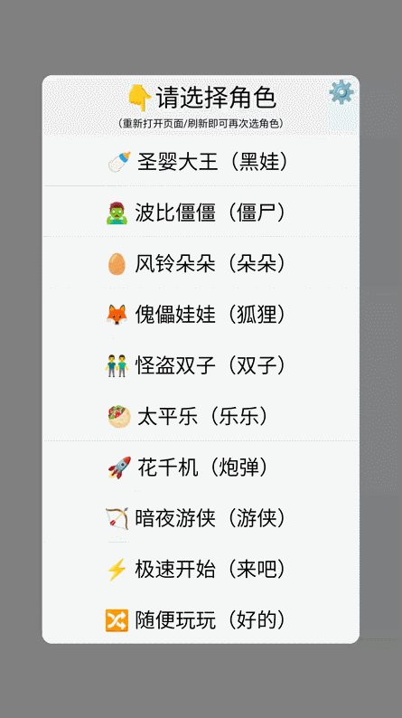

## 简介

`collide-try` 是一个基于原生 `html+js+css`、`canvas` 开发的，模拟带速度和质量球体碰撞的单页小应用。

其实主要用来模拟练习《玩吧-撞击王者》，游戏复盘、经验技巧交流。

1️⃣ 目前支持一个主打角色、三个辅助角色，主要适用于黑娃、僵僵、朵朵、傀儡、双子、太平乐等角色『角度』和『走位』练习

2️⃣ 角色运动速度和距离可能和实战有一定差距，做到一模一样很难

3️⃣ 可能存在个别角度（碰墙角）反弹有点问题，请以实战数据为准

4️⃣ 兼容手机、平板、电脑浏览器

## 预览

## 运行

下载 `collide-try.html`，浏览器打开即可

